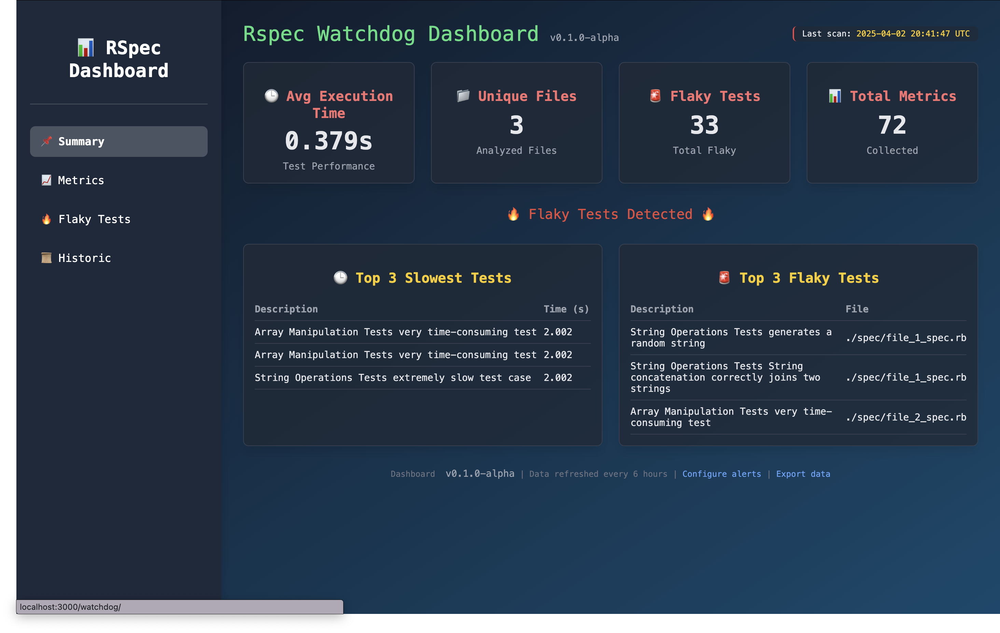

# RspecWatchdog

RspecWatchdog is a gem designed to track the performance and reliability of your RSpec tests. It provides useful metrics like execution times, test failures, and flaky tests. With seamless integration into your existing RSpec setup, you can monitor test performance and diagnose flaky tests, improving both test suite efficiency and reliability.

## Motivation

Testing is a crucial part of the development process, but it can be challenging to track and maintain an efficient test suite. RspecWatchdog offers a simple way to monitor test performance, identify slow tests, and spot flaky tests—helping you improve test reliability and speed. By integrating with rspec-rebound, this gem gives you insights into tests that frequently fail, allowing you to address instability in your suite.

## Features

- **Performance tracking**: Measure the execution time of individual tests to identify slow or inefficient tests
- **Test statistics**: View summary metrics, such as total runs, failures, and average test times
- **Flaky test detection**: Integrated with rspec-rebound to help you spot flaky tests that fail intermittently
- **Minimal dependencies**: The gem only requires RSpec, making it easy to integrate into any project that uses RSpec for testing
- **Optional dashboard integration**: For Rails users, RspecWatchdog can send data to [Watchdog::Dashboard](https://github.com/windmotion-io/watchdog-dashboard) for visualization

## Installation

### Add the Gem to Your Project

Add rspec_watchdog to your Gemfile:

```ruby
gem 'rspec-watchdog'
```

Then, run:

```bash
bundle install
```

## Configuration

Configure rspec_watchdog in your spec_helper.rb or rails_helper.rb.

### Basic Configuration (RSpec-only Projects)

In your spec/spec_helper.rb, add the following:

```ruby
require "rspec/watchdog"

Rspec::Watchdog.configure do |config|
  config.show_logs = true

  # Set these only if using the dashboard integration
  # config.watchdog_api_url = "http://your-app.com/watchdog/analytics"
  # config.watchdog_api_token = "your_secret_token"
end

RSpec.configure do |config|
  config.add_formatter(:progress)
  config.add_formatter(SlowSpecFormatter)

  # To enable flaky test detection, add the following:
  config.flaky_spec_detection = true
  config.flaky_test_callback = proc do |example|
    example.metadata[:flaky] = true
  end
end
```

### Configuration Options

#### `show_logs`

When set to `true`, this option enables additional logging for RSpec tests:

- These logs provide insights into test execution, including test runtimes and other relevant debugging information
- This can be useful for diagnosing slow tests or identifying issues during test runs

#### `watchdog_api_url` (Optional)

This is the endpoint where test execution data will be sent after each RSpec test finishes:

- Only needed if you're using the dashboard integration
- Can point to your own server or a hosted instance of Watchdog Dashboard

#### `watchdog_api_token` (Optional)

This token is used to validate that the request being sent to the API is legitimate:

- If you're running tests in a CI/CD environment (e.g., GitHub Actions or CircleCI)
- Should match the token configured in your dashboard instance

## Usage

After installation, RspecWatchdog automatically hooks into your RSpec test suite. You can start tracking your tests immediately without any additional configuration.

### Running Your Tests

Simply run your tests as usual with RSpec:

```bash
bundle exec rspec
```

RspecWatchdog will capture metrics about your test runs and display them according to your configuration.

### Output Example

RspecWatchdog will output information about your test runs directly to the console:

```
SlowTest: "MyClass#method_1" - 2.31 seconds
SlowTest: "MyClass#method_2" - 1.45 seconds
...
```

### Integration with Watchdog Dashboard (Optional)



For a more comprehensive visualization of your test metrics, RspecWatchdog can send data to [Watchdog::Dashboard](https://github.com/windmotion-io/watchdog-dashboard), a separate Rails engine that provides a visual interface.

To use this integration:

1. Set up Watchdog Dashboard in your Rails application (see the [Watchdog Dashboard README](https://github.com/windmotion-io/watchdog-dashboard))
2. Configure RspecWatchdog with the dashboard URL and API token:

```ruby
RspecWatchdog.configure do |config|
  config.show_logs = true
  config.watchdog_api_url = "http://localhost:3000/watchdog/analytics"
  config.watchdog_api_token = "your_secret_token" # Must match the dashboard token
end
```

## Integration with RSpec-Rebound

RspecWatchdog integrates with rspec-rebound(see the [rspec-rebound README](https://github.com/windmotion-io/rspec-rebound)) to track flaky tests. By enabling both gems in your project, you can easily spot tests that fail inconsistently, making it easier to identify root causes and improve the stability of your test suite.

## Contributing

We welcome contributions to RspecWatchdog! If you have ideas, suggestions, or find a bug, please open an issue or submit a pull request on GitHub.

## License

The gem is available as open source under the terms of the [MIT License](https://opensource.org/licenses/MIT).
